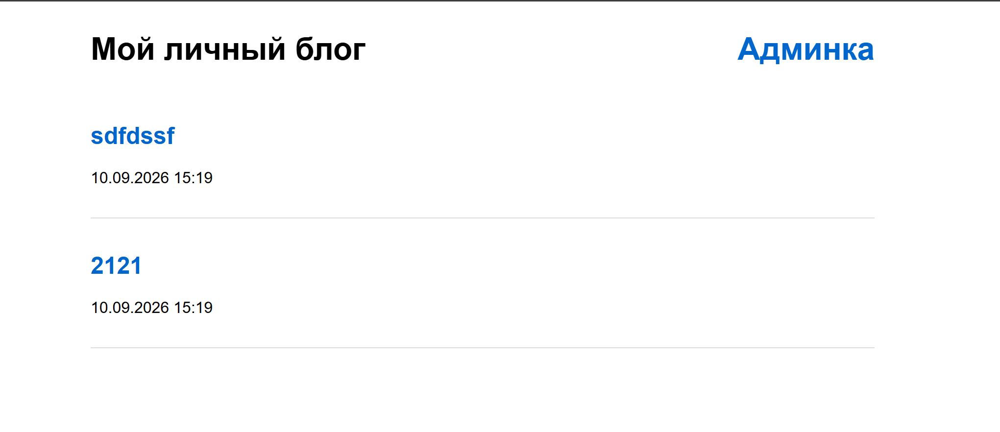
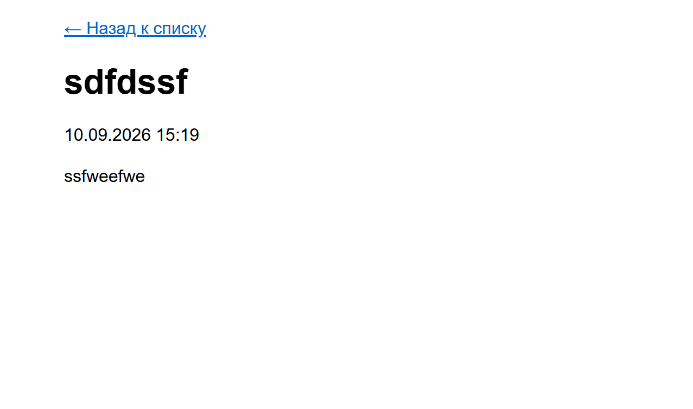
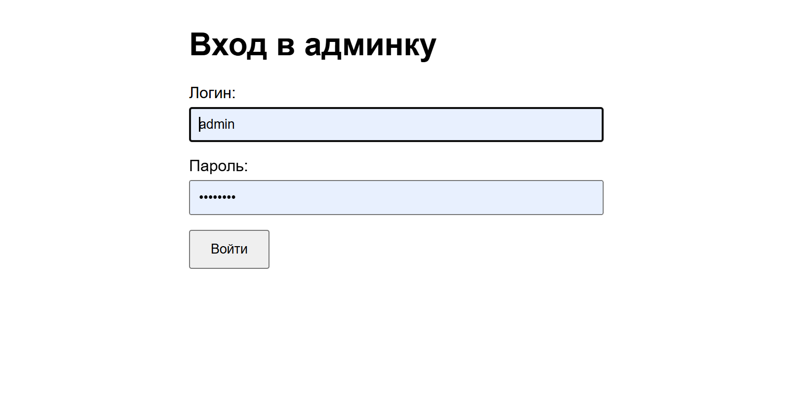
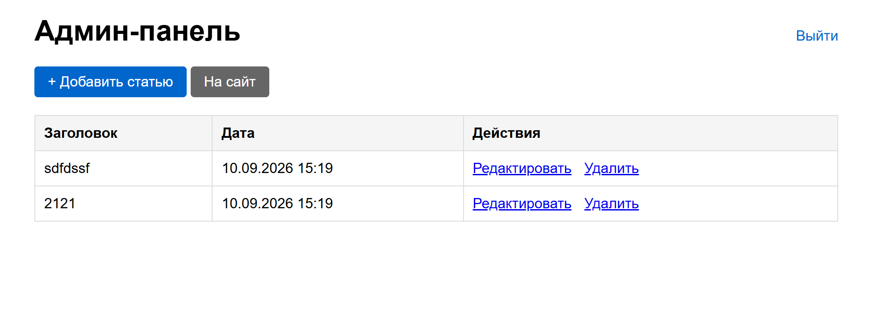
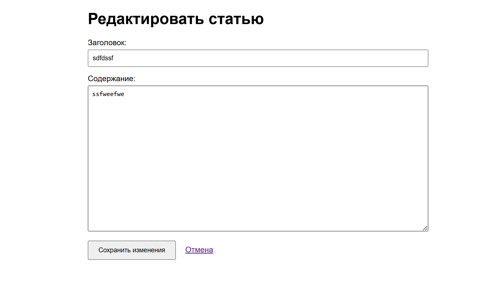

# Personal Blog

A simple personal blog application where you can write, publish, edit and delete articles.  
The blog has a public guest section and a protected admin section.
URL: https://roadmap.sh/projects/personal-blog

## Features

* Home page with a list of all published articles
* Individual article pages with title, content and publication date
* Admin dashboard to manage articles
* Add new articles
* Edit existing articles
* Delete articles
* Basic authentication for the admin section (form login + session)
* Articles stored as JSON files on the filesystem

## Technologies

* Java 21
* Spring Boot 3
* Spring Security
* Spring MVC 
* Jackson (JSON serialization)
* Maven
* SLF4J for logging
```
## Prerequisites

Java 21+
Maven 3.8+

```
## Run the application
```bash
mvn spring-boot:run
```

The application will be available at:  
**http://localhost:8080**

## Usage
## Guest Section (public)

Home — /
List of all articles
Article — /article/{filename}
Full article content + date

## Admin Section (protected)

Login — /login
Admin login form
Dashboard — /admin/dashboard
List of articles + actions
Add Article — /admin/add
Form to create a new article
Edit Article — /admin/edit/{filename}
Form to edit an existing article
**Default admin credentials:**
- Username: `admin`
- Password: `admin123`

## How Articles Are Stored

Each article is saved as a separate JSON file in the configured storage directory.

Example filename:
```
2026-09-10T15-12-34-123456789-my-first-article.json
```

Example content:
```json
{
  "title" : "My First Article",
  "content" : "This is the content of the article...",
  "createdAt" : "2026-09-10T15:12:34.123456789",
  "filename" : "2026-09-10T15-12-34-123456789-my-first-article"
}
```

## Screenshots / Pages

- **Home** — list of published articles

- **Article** — full content of a single article

- **Login** — admin authentication

- **Dashboard** — management panel

- **Add / Edit** — forms for creating and updating articles

